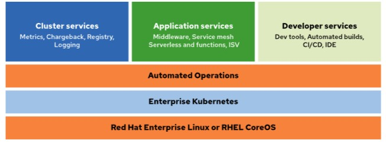
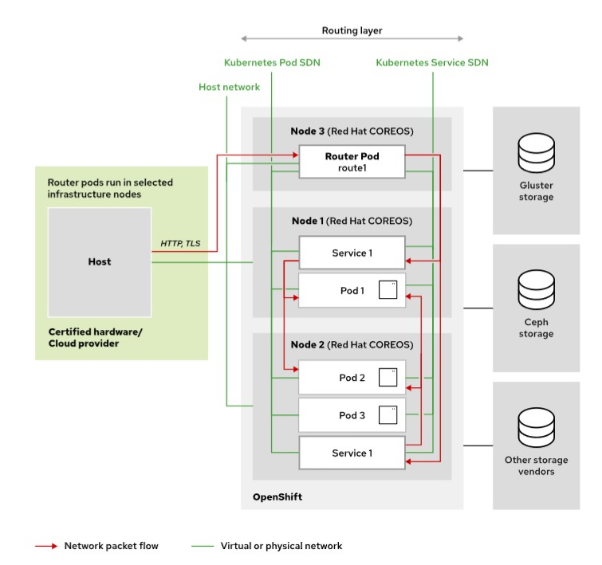
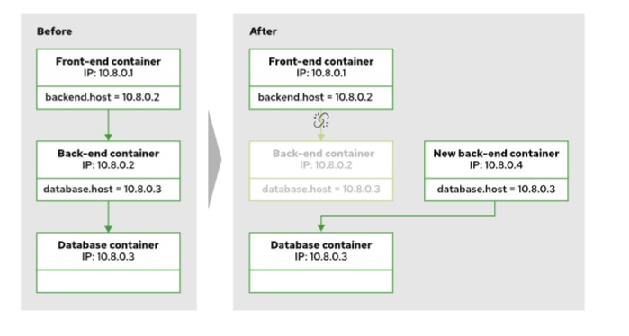
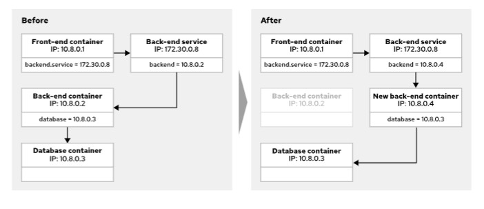
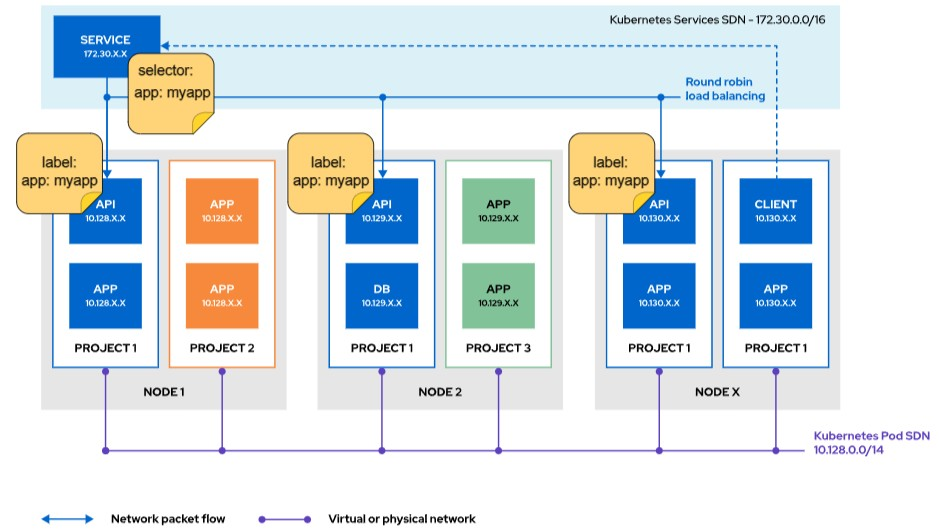

# RedHat ex280
Red Hat Certified OpenShift Administrator exam (EX280) Overview and Preparation. 

Sections:

- [Red Hat OpenShift Platform Architecture](#Red-Hat-OpenShift-Platform-Architecture)
- [Red Hat OpenShift Editions](#Red-Hat-OpenShift-Editions)
- [Red Hat OpenShift Installation](#Red-Hat-OpenShift-Installation)
- [Red Hat Openshift Networking](#red-hat-openshift-networking)
- [OpenShift Container Troubleshooting](#OpenShift-Container-Troubleshooting)

## Red Hat OpenShift Platform Architecture

The following diagram shows the high-level stack that comprises a Red Hat OpenShift Container Platform (RHOCP) deployment.



### Red Hat OpenShift Platform Architecture Overview

The RHOCP architecture begins with the Red Hat CoreOS or Red Hat Enterprise Linux operating systems. By using machines that run one of these operating systems, RHOCP provides the necessary cluster features to deliver the container platform. Additional automated operations continue to build on Kubernetes to deliver an enterprise-class container environment.

Cluster services, such as metrics, a container image registry, and event logging deliver additional features for the environment. Container images are the collection of defined containers that are available within the cluster for deployment. Application services, such as service mesh and other middleware, are also available within the cluster. Additionally, the cluster contains developer services to aid the ongoing application development and platform administration.

The full stack of an RHOCP cluster delivers not only a container runtime environment, but also the additional required tools in enterprise-class deployments to perform the full set of tasks that a modern business application platform requires.

### Components of the RHOCP Stack

#### 1. Red Hat Enterprise Linux (RHEL) or RHEL CoreOS
- **Description**: This is the foundational layer of the stack, providing the underlying operating system on which the OpenShift Container Platform runs. It includes:
  - **RHEL**: A robust and secure Linux distribution tailored for enterprise use.
  - **RHEL CoreOS**: A lightweight, container-optimized version of RHEL specifically designed to run containerized applications efficiently.
- **Role**: Provides the necessary infrastructure and environment for deploying and managing containers and orchestrating them with Kubernetes.

#### 2. Enterprise Kubernetes
- **Description**: This layer represents the core Kubernetes functionality enhanced for enterprise use. Kubernetes is an open-source platform designed to automate deploying, scaling, and operating application containers.
- **Role**: Provides container orchestration capabilities, including scheduling, scaling, and managing containerized applications. It ensures high availability, fault tolerance, and efficient resource utilization within the cluster.

#### 3. Automated Operations
- **Description**: This layer includes tools and features for automating the deployment, management, monitoring, and scaling of applications within the OpenShift environment.
- **Role**: Facilitates the operational tasks associated with managing a containerized environment. It ensures smooth and efficient management of the infrastructure, reducing manual intervention and increasing reliability and performance.

#### 4. Cluster Services
- **Components**:
  - **Metrics**: Collects and stores metrics data from the cluster to monitor performance and resource utilization.
  - **Chargeback**: Provides mechanisms for tracking resource usage and cost allocation for billing purposes.
  - **Registry**: A container image registry to store and manage container images used for deployments within the cluster.
  - **Logging**: Captures and stores logs from applications and system components for troubleshooting and analysis.
- **Role**: Provides essential services that enhance the functionality and manageability of the cluster, ensuring it meets enterprise requirements.

#### 5. Application Services
- **Components**:
  - **Middleware**: Provides essential software components like application servers, messaging systems, and databases that support application development and deployment.
  - **Service Mesh**: Facilitates the management, security, and observability of microservices within the cluster.
  - **Serverless and Functions**: Supports serverless computing and functions as a service (FaaS) for building scalable and event-driven applications.
  - **ISV (Independent Software Vendor)**: Integration with third-party applications and services.
- **Role**: Enhances the capabilities of the platform by offering additional services that support the development, deployment, and management of applications.

#### 6. Developer Services
- **Components**:
  - **Dev Tools**: Includes integrated development environments (IDEs), command-line tools, and other utilities to support developers.
  - **Automated Builds**: Automates the process of building container images from application source code.
  - **CI/CD**: Continuous Integration and Continuous Deployment tools to automate the testing and deployment of applications.
  - **IDE**: Integrated Development Environment for easier coding and debugging.
- **Role**: Provides tools and services that streamline the development process, improving developer productivity and facilitating continuous delivery and integration practices.

Openshift, as a container Platform, includes many critical components for monitoring, automation and scaling. Take a look at the refernce image below for more details


## Red Hat OpenShift Editions

After choosing RedHat Openshift as the container orchastrator for your Business Application, the next step is chosing the edition you will implement. Here is a list of alternatives as of Openshift 4.14

#### Red Hat OpenShift Local
- Deploys a cluster on a local computer for testing and exploration.
- Suitable for initial exploration of OpenShift.
- Not intended for production environments.

#### Red Hat Developer Sandbox
- Provides 30 days of free access to a shared OpenShift cluster.
- Allows testing and exploration of OpenShift features.
- Not intended for production use.

#### Public Cloud Managed Services
- Quick access to OpenShift clusters on Amazon Web Services, Microsoft Azure, IBM Cloud, and Google Cloud.
- Managed by Red Hat and cloud providers, integrating with cloud infrastructure.
- Ideal for businesses seeking reliable and managed cluster deployments.


#### Self-Managed Editions
- Deployable on physical or virtual infrastructure, on-premise or in a public cloud.
- Offers greater control and flexibility but requires more management responsibility.
- Suitable for organizations that prefer to manage their own infrastructure and cluster services.

#### Red Hat OpenShift Kubernetes Engine
- Includes the latest Kubernetes platform with enhanced security and enterprise stability.
- Runs on Red Hat Enterprise Linux CoreOS and includes Red Hat OpenShift Virtualization.
- Provides an administrator console for operational support.

#### Red Hat OpenShift Container Platform
- Builds on the OpenShift Kubernetes Engine with additional manageability, security, and development features.
- Includes a developer console, log management, cost management, and metering information.
- Adds Red Hat OpenShift Serverless (Knative), Service Mesh (Istio), Pipelines (Tekton), and GitOps (Argo CD).

#### Red Hat OpenShift Platform Plus
- The most feature-rich edition, including all features of the Container Platform.
- Adds Red Hat Advanced Cluster Management, Advanced Cluster Security, and Red Hat Quay private registry.
- Designed for comprehensive development and administrative needs for containerized application management.

#### Red Hat Insights Advisor
- Available through the Red Hat Hybrid Cloud Console.
- Helps administrators identify and remediate cluster issues using data from the Insights Operator.
- Provides recommendations and their impacts on the cluster for proactive management.

## Red Hat OpenShift Installation

For this guideline, I will explain 2 options to install RedHat Openshift. Local and Managed Services (ROSA)

## Red Hat Openshift Networking



### Software-Defined Networks in OpenShift

#### The Software-Defined Network
Kubernetes implements software-defined networking (SDN) to manage the network infrastructure of the cluster and user applications. The SDN is a virtual network that encompasses all cluster nodes. The virtual network enables communication between any container or pod inside the cluster. Cluster node processes that Kubernetes pods manage can access the SDN. However, the SDN is not accessible from outside the cluster, nor to regular processes on cluster nodes. With the software-defined networking model, you can manage network services through the abstraction of several networking layers.

#### Managing Network Traffic and Resources
With the SDN, you can manage the network traffic and network resources programmatically, so that the organization teams can decide how to expose their applications. The SDN implementation creates a model that is compatible with traditional networking practices. It makes pods akin to virtual machines in terms of port allocation, IP address leasing, and reservation.

#### Compatibility with Traditional Networking Practices
With the SDN design, you do not need to change how application components communicate with each other, which helps to containerize legacy applications. If your application is composed of many services that communicate over the TCP/UDP stack, then this approach still works, because containers in a pod use the same network stack.

## Kubernetes Networking Drivers and Red Hat OpenShift Cluster

### Kubernetes Networking Drivers
Container Network Interface (CNI) plug-ins provide a common interface between the network provider and the container runtime. CNI defines the specifications for plug-ins that configure network interfaces inside containers. Plug-ins that are written to the specification enable different network providers to control the RHOCP cluster network.

### Red Hat Provided CNI Plug-ins
Red Hat provides the following CNI plug-ins for an RHOCP cluster:

- **OVN-Kubernetes**: The default plug-in for first-time installations of RHOCP, starting with RHOCP 4.10.
- **OpenShift SDN**: An earlier plug-in from RHOCP 3.x; it is incompatible with some later features of RHOCP 4.x.
- **Kuryr**: A plug-in for integration and performance on OpenStack deployments.

Certified CNI plug-ins from other vendors are also compatible with an RHOCP cluster.

### Functionality of CNI Plug-ins
The SDN uses CNI plug-ins to create Linux namespaces to partition the usage of resources and processes on physical and virtual hosts. With this implementation, containers inside pods can share network resources, such as devices, IP stacks, firewall rules, and routing tables. The SDN allocates a unique routable IP to each pod, so that you can access the pod from any other service in the same network.

### OVN-Kubernetes in OpenShift
In OpenShift 4.14, OVN-Kubernetes is the default network provider.

OVN-Kubernetes uses Open Virtual Network (OVN) to manage the cluster network. A cluster that uses the OVN-Kubernetes plug-in also runs Open vSwitch (OVS) on each node. OVN configures OVS on each node to implement the declared network configuration.









## OpenShift Container Troubleshooting

### Container Troubleshooting Overview
Containers are designed to be immutable and ephemeral. A running container must be redeployed when changes are needed or when a new container image is available. However, you can change a running container without redeployment.

Updating a running container is best reserved for troubleshooting problematic containers. Red Hat does not generally recommend editing a running container to fix errors in a deployment. Changes to a running container are not captured in source control, but help to identify the needed corrections to the source code for the container functions. Capture these container updates in version control after you identify the necessary changes. Then, build a new container image and redeploy the application.

Custom alterations to a running container are incompatible with elegant architecture, reliability, and resilience for the environment.

### CLI Troubleshooting Tools
Administrators use various tools to interact with, inspect, and alter running containers. Administrators can use commands such as `oc get` to gather initial details for a specified resource type. Other commands are available for detailed inspection of a resource, or to update a resource in real time.

**NOTE**: When interacting with the cluster containers, take suitable precautions with actively running components, services, and applications.

Use these tools to validate the functions and environment for a running container:

The `oc` CLI provides the following commands:
- `oc describe`: Display the details of a resource.
- `oc edit`: Edit a resource configuration by using the system editor.
- `oc patch`: Update a specific attribute or field for a resource.
- `oc replace`: Deploy a new instance of the resource.
- `oc cp`: Copy files and directories to and from containers.
- `oc exec`: Execute a command within a specified container.
- `oc explain`: Display documentation for a specified resource.
- `oc port-forward`: Configure a port forwarder for a specified container.
- `oc logs`: Retrieve the logs for a specified container.

Besides supporting the previous `oc` commands, the `oc` CLI adds the following commands for inspecting and troubleshooting running containers:
- `oc status`: Display the status of the containers in the selected namespace.
- `oc rsync`: Synchronize files and directories to and from containers.
- `oc rsh`: Start a remote shell within a specified container.

### Editing Resources
Troubleshooting and remediation often begin with a phase of inspection and data gathering. When solving issues, the `describe` command can provide helpful details about the running resource, such as the definition of a container and its purpose.

The following example demonstrates use of the `oc describe RESOURCE NAME` command to retrieve information about a pod in the `openshift-dns` namespace:
```sh
[user@host ~]$ oc describe pod dns-default-lt13h

